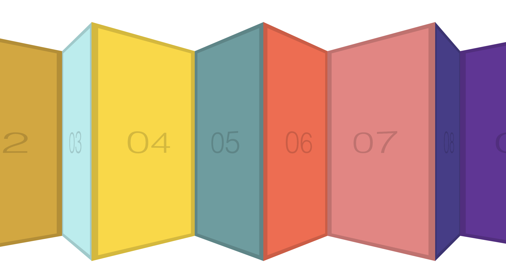

# Click-and-Drag

This is a 30-days javascript grinding  
js30 [https://github.com/ningh98/js30]  
27. Click-and-Drag [https://github.com/ningh98/Click-and-Drag]

## Table of contents

- [Overview](#overview)
  - [Screenshot](#screenshot)
  - [Links](#links)
- [My process](#my-process)
  - [Built with](#built-with)
  - [What I learned](#what-i-learned)


## Overview

The document creates a simple "Click and Drag" interface that allows users to horizontally scroll through a list of items by clicking and dragging the mouse. T

### Screenshot




### Links

- Live Site URL: [https://ningh98.github.io/Click-and-Drag/]

## My process

### Built with

- HTML
- CSS
- Javascript


### What I learned


```js

const slider = document.querySelector('.items')
  let isDown = false
  let startX
  let scrollLeft

  slider.addEventListener('mousedown', (e) => {
    isDown = true
    slider.classList.add('active')
    startX = e.pageX - slider.offsetLeft
    scrollLeft = slider.scrollLeft
    
  })
  slider.addEventListener('mouseleave', () => {
    isDown = false
    slider.classList.remove('active')
  })
  slider.addEventListener('mouseup', () => {
    isDown = false
    slider.classList.remove('active')
  })
  slider.addEventListener('mousemove', (e) => {
    if(!isDown) return
    e.preventDefault()
    const x = e.pageX - slider.offsetLeft
    const walk = (x -startX) * 3
    slider.scrollLeft = scrollLeft - walk
  })


```